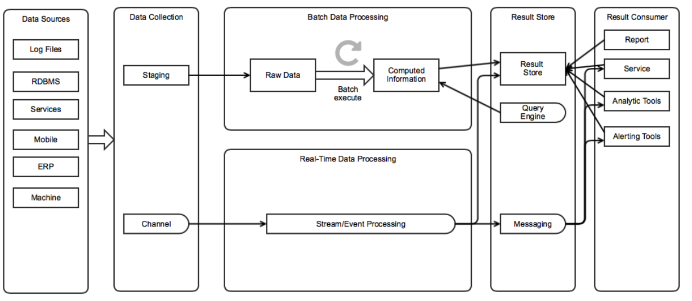
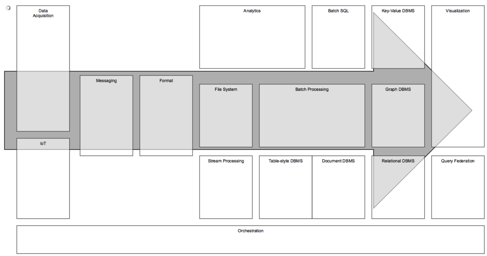
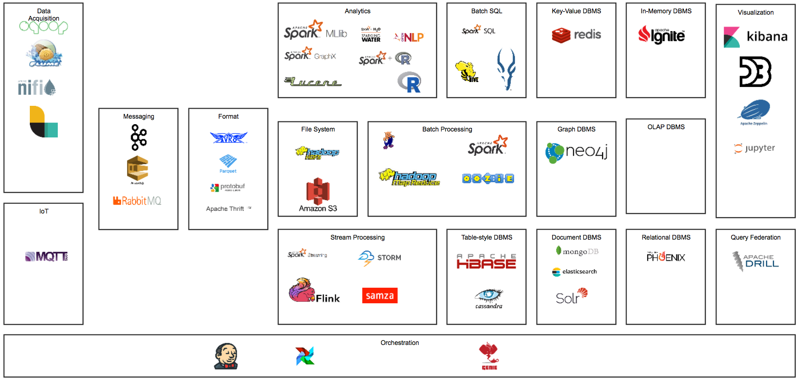
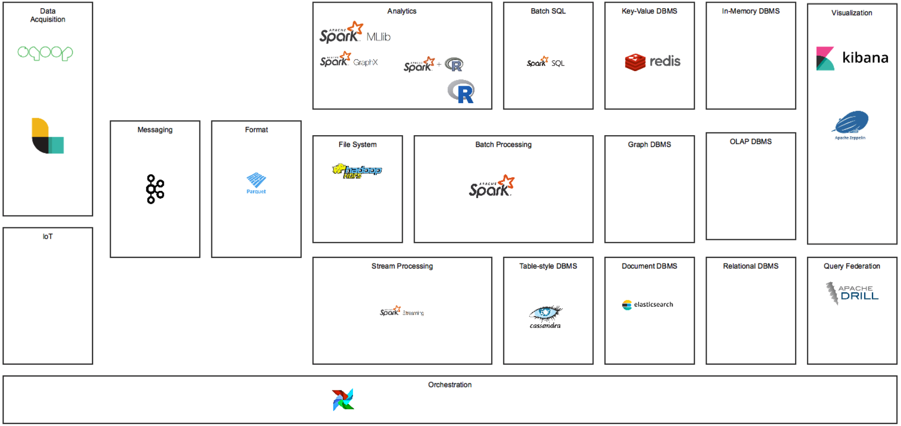
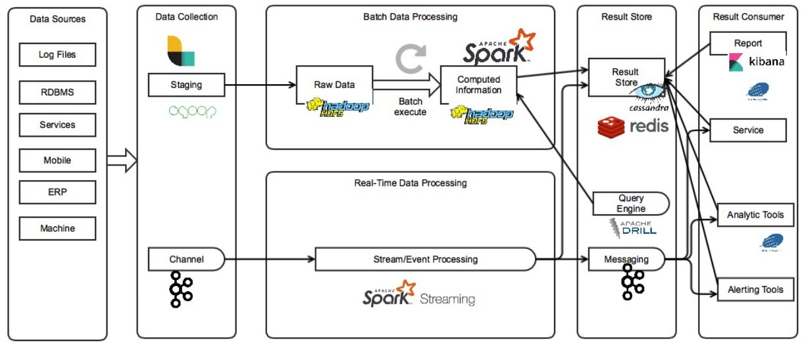

= Big Data Architectures
Jisung, Ahn <narusas.gmail.com>
v1.0, 2018-09-03
:showtitle:
:page-navtitle: Big Data Architectures
:page-description: 빅 데이터 아키텍처를 구성하는 빌딩 블럭에 대해 간단히 소개합니다.
:page-tags: ['big data','architecture']
:page-root: ../../../

== System Overview

.구성
* Data Sources
+
수집하려고 하는 데이터의 소스들입니다.

* Data Collection
+
데이터를 수집하는 메커니즘이 필요합니다. 주기적으로 파일을 옮겨 올수도 있고, DB를 조회할수도 있고, 파일 변화를 주시하며 추가 되는 내용을 스트리밍할수도 있습니다.
+
데이터를 주기적으로 옮기는 곳을 스테이징이라고 합니다. 이때 저장되는 raw 데이터는 보통 용량이 매우 크기 때문에 대용량 저장이 가능한 메커니즘을 사용합니다.
+
실시간으로 전달할때는 채널이라고 부릅니다. 메시지 큐의 형태로 생산자와 소비자를 분리시키는 경우가 많습니다.

* Batch Data Processing
+
수집된 데이터를 주기적으로 처리합니다.

* Real-time Data processing
+
수집된 데이터를 실시간으로 처리합니다.

* Result store
** Result store
+
처리된 데이터를 사용하기 편한 저장소에 저장합니다. 데이터의 성격에 따라 다음을 선택하는 경우가 많습니다.
+
- 대규모의 Row를 가진다면 Document base DBMS
- 복잡한 구조를 가진다면 Relation DBMS
- 쓰기 작업이 집중적으로 이루어진다면 Memory base DBMS

** Query Engine
+
저장된 결과를 쉽게 조회하고 분석하기 위해 SQL 기반의 쿼리 엔진을 포함하여 사용하는 경우가 많습니다.

** Message
+
이벤트에 반응하여 실시간으로 처리하기를 원한다면 Message Queue를 사용하기도 합니다.

* Result Consumer
+
데이터를 사용합니다.
+
- 분석 결과 보고서
- 데이터 서비스
- 분석 도구
- 경고 도구

== Building Blocks

시스템을 구성하기 위한 솔루션 빌딩 블럭에 대한 개요입니다.

* Data Acquisition: 데이터 수집 솔루션
* IoT: Internet of Things를 위한 솔루션
* Messaging: 메시지 처리를 위한 솔루션
* Format: 데이터를 저장하거나 이동하기 위한 포멧
* File System: 빅 데이터 를 저장하기 위한 파일 시스템
* Batch Processing: 주기적 처리를 위한 솔루션
* Streaming Processing: 실시간 스트리밍 처리를 위한 솔루션
* Analytics: 분석 도구
* Batch SQL: 저장된 raw파일을 SQL로 조회하기 위한 솔루션
* Key-value DBMS: 키-밸류 형태로 저장하고 조회하는 DBMS
* Table-style DBMS: 테이블 형태로 저장하고 조회하는 DBMS
* Document DBMS: 문서 기반으로 저장하고 조회하는 DBMS.
* Relation DBMS: 연관 관계에 기반해 저장하고 조회하는 DBMS
* Graph DBMS: 그래프 기반으로 저장하고 조회하는 DBMS
* Query Federation: 다양한 데이터 소스에서 조회를 가능하게 하는 솔루션
* Visualization: 데이터 시각화 솔루션
* Orchestration: 작업들간의 의존관계를 관리하여 작업이 연속될수 있게 한다.

== Big Data Solution Ecosystem

=== Data Acquisition

* Sqoop

* Flume

* Apache NIFI

* Logstash

=== IoT

* MQTT

==  Messaging

* Kafka

* AWS Smple Queue Service

* Rabbit MQ

== Format

* AVRO

* Parquet

* Google Protocolbuf

* Apache Thrift

== File System

* Hadoop File System (HDFS)

* AWS S3

== Batch Processing

* Apache Pig

* Hadoop MapReduce

* Apache Spark

* Oozie

* Apache Beam

== Streaming Process

* Apache Spark Stream

* Apache Storm

* Apache Flink

* Apache SAMZA

== Batch SQL

* Apache Hive

* Apache Spark SQL

* Apache Impala

== Analytics

* Apache Spark MLib

* Apache Spark GraphX

* Apache Spark + H2O Sparklig Water

* OPEN NLP

* R

* Python

* Lucene

== Key-valye DBMS
* Redis

== Table Style DBMS
* Apache HBase

* Apache Cassandra

== Document DBMS
* mongoDB

* elasticsearch

* Solr

== In-memory DBMS
* Apache Ignite

== Relation DBMS

* Apache Phoenix

== Query Federation

* Apache Drill

== Visualization

* Kibana

* D3.js

* Apache Zeppelin Notebook

* Python Jupyter Notebook

== Orchestration

* Jenkins

* Airflow

* Netflix Genie

== My Choice

* Data Acquisition
** Sqoop: DB Table/Queyr → HDFS 를 간단히 할수 있는 솔루션
** logstash: 기존에 사용하던 솔루션
* IoT
** None: 대상없음
* Messaging
** Kafka: Retention 기능으로 안전한 기반 제공
* Format
** Parquet: 대부분의 분석 솔루션에서 지원하는 포멧
* File System
** HDFS
* Analysis
** Spark: 단일 기술 체제를 유지하기 위해 spark 기반으로 선택
** Python
* Stream Processing
** Spark Streaming: 단일 기술 체제를 유지하기 위해 spark 기반으로 선택
* Batch Processing
** Spark: 단일 기술 체제를 유지하기 위해 spark 기반으로 선택
* Batch SQL
** Spark SQL: 단일 기술 체제를 유지하기 위해 spark 기반으로 선택
* Key-Value
** Redis: intensive한 write를 감당하기 위한 메모리 기반 솔루션 선택
* Graph DBS
** None: 대상없음
* Table-style DBMS
** Cassandra: HBase사용시 HDFS를 분석용으로만 사용할수가 없음
* Document DBMS
** Elasticsearch: 기존에 사용하는 솔루션
* In-Memory DBMS
** None: 대상없음
* Relation DBMS
** None: 대상없음
* Query Federation
** Drill: HDFS뿐만이 아니고 다양한 Datasource를 SQL로 조회할수 있음
* Orchestration
** Airflow: Jenkins는 일정기반으로만 가능한 반면, sensor기반으로 workflow동작가능.
* Visualization
** Zeppline: 더 나은 ui.  만약 일반  분석업무도 이 시스템을 사용하게 되면 jupyter가 좋겠지만 추천에서만 사용하기 때문에 더 단순한 솔루션 선택
** Jupyter:  분석용으로 사용할수 있음
** Kibana: 기존에 사용하던 솔루션

== Building block applied

